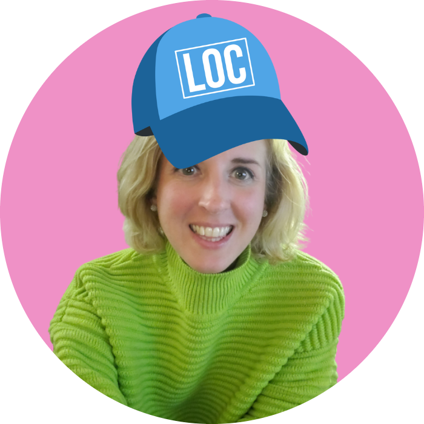

# About

## About the Course Designer

  <figure class="image-circle">
    
  </figure>

  

    Alaina Brandt is a Spanish and English translator, educator, and multilingual technology developer. She is founder and principal trainer at LocEssentials, a consultancy that offers open-source courses on translation and localization management. Brandt holds a Master of Arts in Language, Literature, and Translation from the University of Wisconsin-Milwaukee. She also holds professional education certificates from MIT in generative AI and digital transformation, data science and machine learning, and web programming. She has served on the executive committees of both the American Translators Association and ASTM F43, a technical committee that writes and maintains international standards on language services and products. She has taught translation and localization at universities in Mexico, China, and the United States.
  

## About LocEssentials

[LocEssentials](https://locessentials.com) is a consultancy that curates open-source courses on translation and localization management and offers services that complement our course offering, including coaching, work assessments, and consulting. Our expertise spans translation and localization, quality management, terminology, and technology. We also develop courses and solutions customized to the specific needs of your organization.

