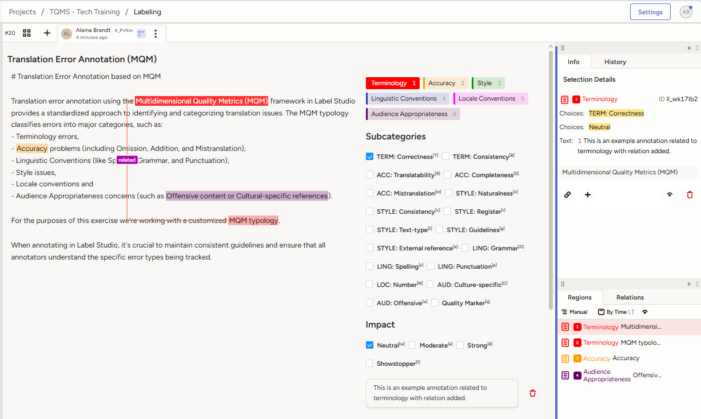
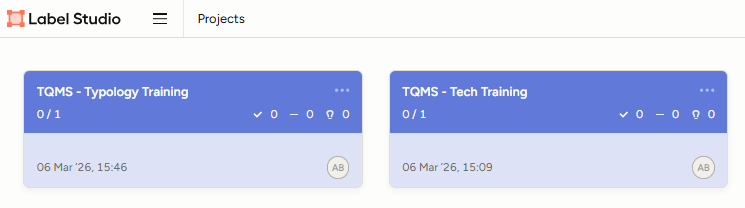

# Lesson 4: Error Annotation Environment

As you learned in the last lesson, the TQMS presented here requires projects to be evaluated within an annotation environment. In this lesson, we discuss two types of annotation environments, the pros and cons of each. Specifically, we compare traditional **translation environment tools (TEnTs)** to **professional annotation tools** used in machine learning.

## The Shortcomings of TEnTs

The status quo of the translation industry is sentence-by-sentence translation performed in TEnTs. This methodology arose not out of a concern for quality, but from the desire to drive down the cost of translation by recycling previously translated sentences stored in a translation memory (TM) into new projects. Underneath this methodology is a view of translation as a commodity, and the widespread use of TEnTs has both driven down the rates paid to translators and led to the dissemination of translations that give the wrong impression of what actually translation is.

Due to CAT technology, and the machine translation methodologies built on TMs, translation is taken to be an activity of translating isolated sentences. We can think of translation performed according to this methodology as a [jail cell](https://alainambrandt.locessentials.com/why-sentence-translation-wont-deliver/) approach, which prevents the reformulation of paragraphs, sections of text, and even whole texts to match the style of writing of the target language. Even MT scoring systems like [BLEU](https://arxiv.org/pdf/1911.03823) privilege literal translations.

This view extends to localization as well. Rather than designing systems to be [culturally ergonomic](https://loc801.locessentials.com/ref/Tsai_CulturalErgonomics_2024.pdf) for target audiences, localization is taken to be the act of simply incorporating literal, sentence-by-sentence translations in as system that has been designed with just one audience in mind. In the context of the United States, and indeed internationally due to the influence of the Silicon Valley worldwide, this means that English-speaking (or lingua franca speaking) users use systems designed specifically with their way of viewing the world in mind. Everyone else is stuck with systems that have not been designed for them, except for incorporating literal, hard to understand translations.

In reality, translation should take a whole document approach, in which a text can be written as a cohesive unit, while also taking into account the larger context of [related content](https://www.ttt.org/wp-content/uploads/2022/05/Melby-Foster-Context-in-Translation.pdf) written about a subject in the world. The paper "[Escaping the sentence-level paradigm in machine translation](https://arxiv.org/pdf/2304.12959)" outlines specific challenges within segmented translation environments that can be solved by taking into consideration a larger context, such as elements of a text like anaphora, deixis, and discourse connectiveness.

Given that TEnT and indeed MT systems are designed to produce literal, sentence-by-sentence translations that are of poor quality, building a TQMS atop this fundamentally flawed methodology cannot remedy its structural deficiencies. The more pressing question is whether sentence-level translation should remain the industry standard at all.

| **Cons** | **Pros** |
| ----- | ----- |
| Sentence-level segmentation prevents cohesive, whole-document translation | Translators and editors are already familiar with working in CAT environments |
| TMs incentivize reusing poor-quality legacy translations rather than producing better ones | For highly repetitive, boilerplate content, TM recycling can be genuinely appropriate; the methodology isn't wrong for every content type. |
| Quality evaluation frameworks built on segment-level methodology cannot assess discourse-level features like anaphora, deixis, and cohesion |  |

### What About Quality Evaluation in CAT Tools?

Some CAT tools do offer built-in quality evaluation features, including MQM-style annotation and error-marking functionality. However, these implementations tend to reflect the same structural limitations as the tools themselves: error assignment is often restricted to one error per segment, typologies are fixed across all projects rather than tailored to content type, and annotation data is locked inside the tool's XLIFF editor, making it difficult to export for use in machine learning pipelines or cross-project analysis.

For practitioners who want to perform rigorous, reusable quality evaluations, a dedicated annotation environment is a better fit. The remainder of this page introduces Label Studio as a professional annotation tool designed for exactly this kind of work.

## Label Studio

[Label Studio](https://labelstud.io/guide/get_started) is an open-source data annotation platform designed for building and managing labeled datasets for machine learning. Unlike CAT tools, it is built from the ground up for structured, exportable annotation workflows, making it well-suited for MQM-based translation quality evaluation. Label Studio supports highly configurable labeling interfaces, allowing typologies to be tailored to specific content types and projects.

### Annotation Environments vs. CAT Tools for MQM Evaluation

**Pros**
- Annotation data can be easily exported for use in machine learning pipelines and cross-project analysis
- Multiple errors can be assigned to a single segment, enabling detailed, overlapping annotations
- Typologies can be configured per project, allowing content-specific error categories rather than a one-size-fits-all approach

**Cons**
- The source text must be viewed outside of the platform, requiring annotators to switch between windows
- The interface does not dynamically filter subcategories based on a selected parent category, meaning annotators must navigate the full list regardless of which error type they are working with
- Annotating longer documents requires significant scrolling, as returning to the point of annotation after selecting subcategories is not automatic

### How to Use Label Studio

<figure class="image-center image-full">
  
  <figcaption>The Label Studio annotation interface configured for MQM-based translation error annotation, showing error categories, subcategories, impact ratings, and the annotation regions panel.</figcaption>
</figure>

**Creating a new annotation**

- If you are the first person to annotate a project, a tab for your annotations will be automatically created for you.
- If someone else has already started their annotation of the project, click the + icon next to the tab with their name to create your workspace. 
- Remember to try not to look at other annotators' work until you've already submitted your annotations.

**Annotating errors and quality markers**

- Select a label category and highlight a span of text
- Pick the relevant subcategory, ensuring it corresponds to the selected parent category
- Quality markers can be assigned within any error category
- Assign an impact level
- Leave a brief comment (one to two sentences) explaining the error
- Add bidirectional or unidirectional relationships between annotations where relevant

**Editing annotations**

- You can change the category of an annotation by selecting it and choosing a different category
- You can delete an annotation by selecting it and clicking the delete icon

**After you've finished your annotation**

- Review your results in the Regions panel and ensure all annotations are complete and correct
- Based on the nature of the errors, leave a comment on any issues that repeat throughout the document
- Give overall correspondence and readability ratings with a comment explaining your scores
- Submit your evaluation

### Active Learning

In the lesson on [standards](standards.md) you were introduced to the article "[AI Could Actually Help Rebuild the Middle Class](https://www.noemamag.com/how-ai-could-help-rebuild-the-middle-class/)" and asked to write translation specifications for it. Now, you'll have a chance to practice error annotation of a Mexican Spanish translation of that text.

First, you'll want to create an account on the instance of Label Studio that we have set up for LocEssentials. Do so [here](https://labelstudio.locessentials.com/user/signup/?token=NmyTDpp4Z6g3Ebhd2YKkMyEoGayNIuY4nEisW3hs).

Please note that the system does not have a way for you to reset your password if you lose it. If you do, please email [alaina@locessentials.com](mailto:alaina@locessentials.com) for help resetting your password.

You'll see two projects in the dashboard with a blue background. One is named TQMS - Tech Training and the other is named TQMS - Typology Training.

<figure class="image-md">
  
  <figcaption>The Label Studio Projects dashboard showing the two training projects assigned for this lesson.</figcaption>
</figure>

Start with the Tech Training project, where the only goal is to get comfortable navigating the interface. When you feel ready, move on to complete the Typology Training.

**Important notes**

- When working in the Label Studio environment, you will have access to all projects in the system. Please work only in the projects assigned to you. Projects related to LocEssentials are marked with a blue cover in the dashboard.
- Your annotations are stored alongside those of other annotators. Avoid viewing others' annotations until you have completed your own review to prevent bias.

**Reflection**

As you work, reflect on these questions:
- How does the Label Studio environment compare to editing in a CAT tool?
- Which errors were hardest to classify, and why?
- After you finish, explore the other annotators' tabs to see how their work differs from yours. In the next lesson, you'll learn how to perform exploratory data analysis across annotations.

---

## Up Next: Exploratory Data Analysis

Up next, we'll explore methods for measuring agreement, identifying patterns, and determining where calibration is needed from the annotation data that teams of evaluators have produced.