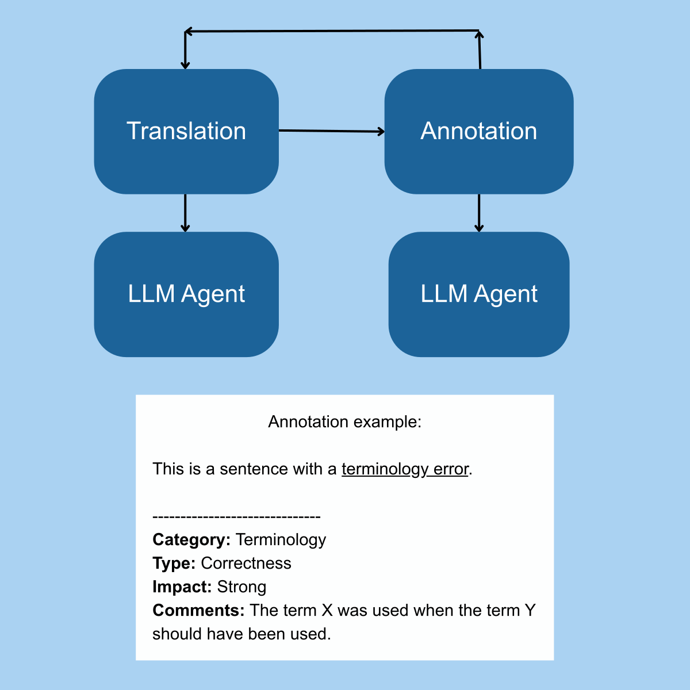

# Lesson 2: MQM Error Typology & Holistic Quality

In this lesson we'll work with the MQM Error Typology, a framework for translation error marking that can be applied to both human and automatic translation. According to the [MQM website](https://themqm.org), "MQM can be used to identify quality issues in translation products, classify them against a shared, open and standardized error typology, and generate quality measures that can be used to gauge how well the translation product meets quality requirements." Error marking that follows a standardized framework like MQM also enable the root cause analysis and the incorporation of preventative actions that make translation production more efficient and higher quality on the first shot over time.

The annotations that are produced using systems like MQM can be used to teach evaluators to carry out better evaluations, to train LLMs to perform quality evaluations, and to produce feedback that can help translators to learn to translate better. Better translations by humans can be used to train LLMs to perform translation better as well.

<figure class="image-center image-md">
  
  <figcaption>Translation and annotation workflow with LLM agents</figcaption>
</figure>

Although this course centers upon MQM, we'd like to note that this framework may not be appropriate for annotating translations in all languages. Before adopting a system like MQM, it's important to evaluate whether its organization corresponds with mental maps of how people think about translation errors in a specific language.

## Customized MQM Typology

The MQM core typology includes thirty-eight error types in seven categories. Here, we present a customized (and simplified) version of the core typology with **seventeen error types** in **six categories**, understanding that the more error types that evaluators need to check for, the more likely that errors will be miscategorized or missed. 

While translation systems that incorporate the MQM typology tend to allow just one version of it to be applied across content types and projects, we recommend designing specific typologies that address the error types that need to be checked for within your specific content types, and based upon the specifications that have been established for the work.

For example, an "omission" error label is generally assigned when the target translation omits information that was included in the source text. However, making selective omissions is often required for content with space limits, such as the character limits associated with subtitles. If omissions are needed to keep within space limitations, you may want to include a more specific error type that encourages the omission of the **right** kind of information. If the translation omitted the rheme (new information), instead of the theme (known information) that could constitute a "rheme omission" error in subtitling work.

Here we present a customized error typology, along with discussion of each of our error types, and how to apply quality markers.

### Terminology

| Type | Discussion |
| ----- | ----- |
| Correctness | Terminology usage should be correct given the context of the domain and audience and if glossaries are provided, they should be followed (unless they're wrong). |
| Consistency | In some types of texts, terminology usage should be consistent. For other types of texts and in some languages, elegant variation of terminology is preferred. |

### Accuracy

| Type | Discussion |
| ----- | ----- |
| Translatability | All text that should have been translated was left untranslated. No text that should have been left untranslated was translated. |
| Completeness | Complete translation generally avoid omissions and additions. They also avoid over- and under-translation. Over-translation introduces incorrect specificity (e.g. a specific type of flower is named rather than the general idea of flowers), and under-translation introduces incorrect generalizations (e.g. a specific tool was mentioned and that was referenced in a more general sense as a tool) |
| Mistranslation | Mistranslations are the result of misunderstanding the sense conveyed in the source text. |

### Style

| Type | Discussion |
| ----- | ----- |
| Naturalness | Translations should read naturally to the audience of the translation and should avoid literal renderings that cloud understanding. |
| Consistency | Generally, stylistic conventions should be consistent throughout a translation. Consistency in style is reflected in the way that certain textual features (headers, image captions) are handled. |
| Register | The register is the level of formality of the text. Register manifests in a number of ways. In some languages, register is reflected in grammar. Word choice also impacts the formality of a text. |
| Text type | Text types have their own conventions that should be followed. For example, a prompt written for an LLM should generally use the second person "you". |
| Guidelines | When style guidelines are provided, they should be followed (unless they are wrong). |
| External reference | External references sometimes impact how a text should be written. For example, a requester may require that APA citation format be followed. |

### Linguistic Conventions

| Type | Discussion |
| ----- | ----- |
| Grammar | Texts should follow the grammar rules of a language. Depending on the audience, what are considered the "standard" grammar rules may not apply. |
| Spelling | Spelling involves not only avoiding typos, but using hyphens and capitalization correctly. Spelling should also correspond to the language variant in which the text was to be written. |
| Punctuation | Punctuation is not used the same across all languages. Punctuation should be used in keeping with target language conventions. |

### Locale Conventions

| Type | Discussion |
| ----- | ----- |
| Number | Numbers are used in texts in a variety of ways: as dates, currencies, measurements, etc. |

### Audience Appropriateness

| Type | Discussion |
| ----- | ----- |
| Culture-specific | Depending on whether a foreignized or domesticated approach has been followed, culture-specific references may need to be localized for the target market. In web content, links should be updated to lead to links in the target language. |
| Offensive | Translations should not be offensive. Offensive translations may arise out of automatic translation or using the incorrect variant of a language. |

### Quality Markers

What we find to be a gap in the MQM framework is that there's no natural way to highlight areas of a translation that are particularly well done. While identifying errors is crucial, focusing solely on problems misses a key opportunity. Without positive reinforcement, translators and quality managers aren’t systematically trained to recognize strengths. Here we miss the chance to reinforce and consciously develop what a translator is already doing well.

Our system incorporates a **quality marker** label that can be assigned to any of the above categories (terminology, accuracy, style, etc.). The purpose of this marker is not to flag translations that are merely correct, since that should be baseline. Instead, quality markers are areas in which the translation has solved a particularly challenging feature of the source text.

### Levels of Impact

The MQM framework assigns severity levels to translation errors, ranging from neutral, minor, major, and critical. An error that has been classified as neutral may be one where an alternative translation would be better, even though the existing translation was correct. A minor error is one that does impact the ability of the content to be used. A major error does impact the ability of the content to be used as intended. A critical error is one that would result in severe damage, either physically or reputationally.

Because we've incorporated quality markers into our customized typology, we felt it necessary to shift from "Severity Levels" to "Level of Impact." We named our levels **neutral**, **moderate**, **strong**, and **showstopper**, where any of these levels can be applied and make sense for either errors or quality markers.

## Holistic Quality

After marking individual errors and understanding the nature of the errors reflected in the translation, translations can be rated on their overall **correspondence** and **readability**, where:

- For correspondence: 1 means significant differences in meaning and 4 means excellent correspondence in meaning, and
- For readability: 1 means difficult to read and 4 means natural to read,

Both given such specifications as audience and purpose.

Here, correspondence is how well the translation reflects the senses conveyed in the source, and readability is how well the translation would read to the specific audience the translation has been written for. If the text even contains one **strong** error, we tend to rate the translation as no more than a two in one or the other category, depending on the nature of the error.

## Effectiveness of the Translation

Once holistic ratings have been established, they can be used to determine the overall effectiveness of the translation.

| | Correspondence | Readability | Description |
| ----- | ----- | ----- | ----- |
| Effective | 4 | 4 | The translation fully facilitates the specific audience's understanding and allows the text to be appropriately used. |
| Mostly effective | 3 | 3 | The translation mostly facilitates the specific audience's overall understanding. It has minor errors that do not impede the text from being used. |
| Somewhat ineffective | 2 | 2 | Parts of the translation impede understanding and the overall use of the content. |
| Ineffective | 1 | 1 | The translation can't be understood or is significantly incomplete. |

Note that when a translation receives a low readability score that also negatively impacts its correspondence. The way to achieve correspondence in translation is not through literal translations that impede understanding, even as automatic quality metrics from the machine translation community like [BLEU](https://arxiv.org/pdf/1911.03823) favor literal translations.

## Active Learning

Find, write, or generate examples of translations that would constitute the error types discussed above. You can draw upon examples that you've encountered when working with bilingual content, write or describe an example, or ask an LLM to generate an example for you. If you're working with a team, examples are a great way to surface types of issues that people are categorizing differently as you work toward a harmonized understanding of translation errors. Later, the examples you found can be used to train newcomers and help them to understand how you and your team categorizes errors.

---

## Up Next: Translation Quality Management Workflows

Up next, we'll look at how to build a system that trains evaluators to apply this typology consistently across a production environment.
