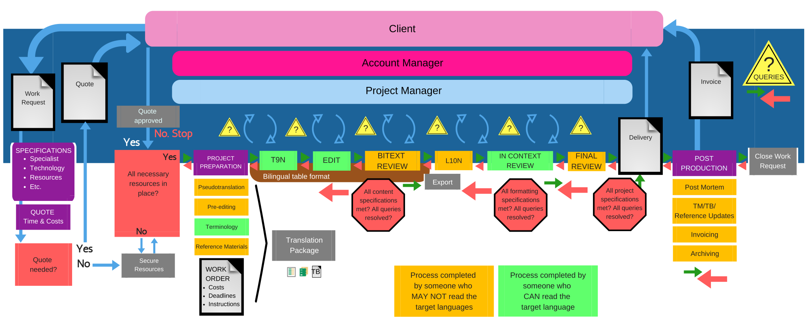

# Lección 6: Análisis de causa raíz y mejora continua

En la lección anterior analizaste las anotaciones producidas por tu equipo para determinar dónde se superponían los fragmentos, dónde no, qué categorías de error se aplicaron de manera consistente y cuáles no. Ese análisis te dio una imagen clara de dónde se está fracturando la concordancia, y qué hacer al respecto dentro del proceso de anotación. Los problemas de calibración se abordan mediante materiales de capacitación específicos y sesiones de calibración.

Pero los datos de anotación también cuentan una historia más amplia. Una vez que el equipo de evaluación se despliega en un entorno de producción, sus anotaciones comienzan a generar datos sobre los errores más frecuentes en los proyectos. Vale la pena señalar que los errores de traducción en sí mismos no son un problema. En un flujo de trabajo estándar de traducción, revisión y corrección de estilo, esperamos que una traducción llegue con algunos errores. Precisamente por eso la edición está planificada como un paso posterior. Sin embargo, un error que aparece en un proyecto es distinto de un error que aparece proyecto tras proyecto. Ese segundo escenario es un problema de proceso, y los problemas de proceso tienen causas raíz que pueden identificarse y atenderse. La tarea de quienes gestionan la calidad en esta etapa es preguntar por qué, y seguir preguntando hasta que la respuesta apunte a algo sobre lo que sea posible actuar.

Este es el trabajo de la **mejora continua**: la actividad recurrente de usar los datos de producción para mejorar el rendimiento con el tiempo. Esta lección presenta dos métodos prácticos para identificar causas raíz, el Diagrama de Ishikawa y los 5 Por Qués, y los sitúa en el contexto de la producción de traducción y localización usando la lista de causas raíz de errores de MQM.

## Acción correctiva y mejora continua

En términos de la ISO 9001, la **acción correctiva** es la acción tomada para eliminar la causa de una no conformidad y evitar que se repita. Cuando se identifica un producto no conforme, uno que supera el umbral de error para un paso de producción determinado, la organización está obligada no solo a atender el producto, sino también a investigar la causa raíz y actuar en consecuencia. La norma exige además que las acciones correctivas se evalúen en cuanto a su efectividad y se revisen hasta que la causa raíz quede genuinamente resuelta.

El trabajo descrito en esta lección opera con el mismo espíritu, incluso cuando ningún proyecto individual ha cruzado técnicamente el umbral de no conformidad. Al monitorear los errores frecuentes en un entorno de producción y abordar sistemáticamente sus causas, un sistema de gestión de calidad en traducción acumula valor con el tiempo. A medida que se eliminan los errores recurrentes, el sistema genera retroalimentación más precisa para el personal traductor, datos de entrenamiento más confiables para los LLMs y un flujo de trabajo de producción más eficiente.

## Métodos de análisis de causa raíz

Dos métodos especialmente útiles para identificar causas raíz en flujos de trabajo de traducción y localización son los **Diagramas de Ishikawa** y los **5 Por Qués**. Estos métodos se complementan entre sí. El Diagrama de Ishikawa es útil para mapear el espacio completo de causas posibles antes de haber identificado la más probable. Los 5 Por Qués son útiles para profundizar en una causa específica una vez que se ha acotado el foco. En la práctica, el Diagrama de Ishikawa puede usarse en una sesión de equipo para generar hipótesis, y luego aplicar los 5 Por Qués a la rama más probable.

### Diagramas de Ishikawa

El Diagrama de Ishikawa (también llamado diagrama de espina de pescado o diagrama de causa y efecto) es una herramienta visual para mapear todas las posibles causas de un problema. El problema se escribe en la cabeza del "pez" y las causas se ramifican desde la columna vertebral, agrupadas por categoría. Lo que hace valioso al enfoque de Ishikawa es que obliga a considerar múltiples dominios de causalidad al mismo tiempo: no solo la persona traductora, sino también las herramientas, los plazos, el encargo, el texto fuente y el proceso mismo.

  <iframe width="560" height="315" src="https://youtu.be/b7oyL0E0mfs?si=4I6JTnrdUAZfxyA-" title="Diagrama de Ishikawa" allowfullscreen></iframe>

<figcaption>*Cita: Ana Dominguez. 2021. "Diagrama de Ishikawa". YouTube.*</figcaption>

### Los 5 Por Qués

Los 5 Por Qués es una técnica de cuestionamiento iterativo que desciende desde un síntoma superficial hasta su causa subyacente mediante una pregunta repetida: ¿por qué? La técnica es simple, pero puede ser poderosa cuando se aplica con honestidad. El objetivo no es llegar a una respuesta conveniente, sino seguir preguntando hasta alcanzar una causa sobre la que sea posible actuar.

  <iframe width="560" height="315" src="https://youtu.be/1K0r_QuZDvI?si=bYIBxt5hSvXgLzjb" title="La técnica de los 5 Por qué de Toyoda" allowfullscreen></iframe>

<figcaption>*Cita: Patricia Neito Coach. 2021. "La técnica de los 5 Por qué de Toyoda y cómo utilizarlo como líder". YouTube.*</figcaption>

## Causas raíz en la producción de traducción

Suele asumirse que un error en la traducción es responsabilidad de la persona traductora o posedítora, pero el análisis de causa raíz frecuentemente saca a la luz causas más profundas: un glosario que nunca se proporcionó, un texto fuente ambiguo, un cronograma que no contempló tiempo suficiente para la revisión. El objetivo del ACR en un sistema de gestión de calidad en traducción no es asignar culpas, sino identificar dónde puede fortalecerse el flujo de trabajo. Cada ronda de análisis es una oportunidad para eliminar un punto de fricción y, con el tiempo, esa iteración sostenida es lo que transforma un sistema de calidad funcional en uno optimizado.

<figure class="image-center image-full">
  
  <figcaption>Un flujo de trabajo de traducción y localización, desde el alcance del proyecto hasta la posproducción. Las causas raíz pueden originarse en cualquier etapa.</figcaption>
  <figcaption>*Imagen publicada en [Translation and localization project and process managers](https://www.degruyter.com/document/doi/10.1515/9783110716047-008/pdf), Handbook of the Language Industry, De Gruyter Mouton (2024).*</figcaption>
</figure>

Para respaldar el ACR sistemático en traducción y localización, el marco MQM ofrece una [Lista de Causas Raíz de Errores](https://themqm.org/resources/root-causes/) (en inglés): una taxonomía de causas previas a la traducción que con frecuencia originan errores en el producto traducido. La lista está organizada para alentar a quienes gestionan la calidad a ir más allá de la traducción misma y examinar la preparación y el proceso que la precedieron.

### Un ejemplo desarrollado

Para ilustrar esto con concreción, imaginemos un error recurrente de **Exactitud: Traducción errónea** identificado en múltiples proyectos del mismo tipo de contenido. Las personas evaluadoras están marcando de manera consistente traducciones en las que el sentido del texto fuente no parece ser trasladado correctamente, no porque la persona traductora haya leído mal el texto, sino porque el texto fuente era lo suficientemente ambiguo para admitir más de una interpretación.

Aplicar los 5 Por Qués podría verse así:

1. *¿Por qué la traducción transmite un sentido incorrecto?* La persona traductora interpretó una frase ambigua del texto fuente de una manera que difiere de la intención de quien lo escribió.
2. *¿Por qué no se resolvió la ambigüedad antes de entregar la traducción?* La persona traductora envió una consulta, pero esta no llegó a tiempo a quien solicitó el servicio, o no llegó en absoluto.
3. *¿Por qué no llegó la consulta?* La capa de gestión de proyectos de la agencia recibió la consulta, pero no la escaló, ya sea por presión de tiempo o por falta de un protocolo de escalación claro.
4. *¿Por qué no existe un protocolo de escalación claro?* Las consultas del personal traductor no están definidas como un paso formal dentro del flujo de trabajo de producción, por lo que no hay una ruta establecida para canalizarlas a la persona indicada.
5. *¿Por qué no?* El flujo de trabajo fue diseñado en torno a la velocidad y los traspasos, sin ningún mecanismo para pausar y resolver una duda sobre el contenido.

La causa raíz es un fallo en el diseño del flujo de trabajo: el proceso de producción no tiene una ruta formal para resolver ambigüedades en el texto fuente una vez que el proyecto está en marcha. En este caso, la acción correctiva es establecer un protocolo de escalación de consultas que las canalice directamente a quien solicitó el servicio, con una ventana de respuesta definida. Una segunda acción correctiva, más temprana en la cadena, va aún más lejos: si el texto fuente hubiera sido preedítado antes de iniciar la traducción, la ambigüedad se habría detectado antes de convertirse en un problema para la persona traductora, lo que señala el valor de incorporar revisiones del texto fuente en el proceso de recepción de proyectos.

## Aprendizaje activo

### Calentamiento: Explorar la lista de causas raíz de errores

Revisa la [Lista de Causas Raíz de Errores](https://themqm.org/resources/root-causes/) (en inglés) publicada en TheMQM.org. Mientras lo haces, considera lo siguiente:

- ¿Hay causas raíz que no te resulten familiares? Para las que no, investiga a qué se refieren.
- ¿Qué tipos de error de la tipología MQM podría producir cada causa raíz?
- ¿Qué acción preventiva podría implementarse para atender cada causa raíz?

Usa la tabla siguiente como punto de partida y agrégale filas adicionales conforme avances en la lista.

| Tipo de error | Causa raíz | Acción preventiva |
| ----- | ----- | ----- |
| Exactitud: Traducción errónea | Texto fuente ambiguo | Incorporar una revisión del texto fuente antes de iniciar la traducción |
| Estilo: Registro | No se proporcionó guía de estilo | Agregar directrices de formalidad a una guía de estilo de nueva creación |

### Plan de ACR y acción correctiva

Encuentra un ejemplo de un producto traducido o localizado con una no conformidad sustancial. Puede ser algo que hayas encontrado en tu propio trabajo, que hayas notado en el mundo o que puedas localizar mediante investigación. A partir de él, elabora un breve informe profesional, redactado como si fuera a ser revisado por personas tomadoras de decisiones con control sobre presupuestos y personal.

Tu informe debe incluir:

1. **Descripción de la no conformidad.** Identifica el producto, describe la no conformidad y señala exactamente dónde se presenta. Incluye una captura de pantalla u otro tipo de ilustración si es posible.
2. **Análisis de causa raíz.** Aplica el Diagrama de Ishikawa o los 5 Por Qués para identificar las posibles causas. Documenta tu análisis de forma visual y luego narra en texto las ramas causales más significativas. Explica por qué consideras que una causa raíz es la más probable.
3. **Plan de acción correctiva.** Describe la acción correctiva que implementarías. Explica quiénes deberían participar, cómo sería el proceso y cómo se incorporaría el cambio a la producción en curso.
4. **Seguimiento.** Explica cómo verificarías que la acción correctiva fue efectiva. Identifica las dos causas raíz más probables que investigarías si la primera no resulta ser la correcta.

---

## A continuación: Conclusión y lecciones aprendidas