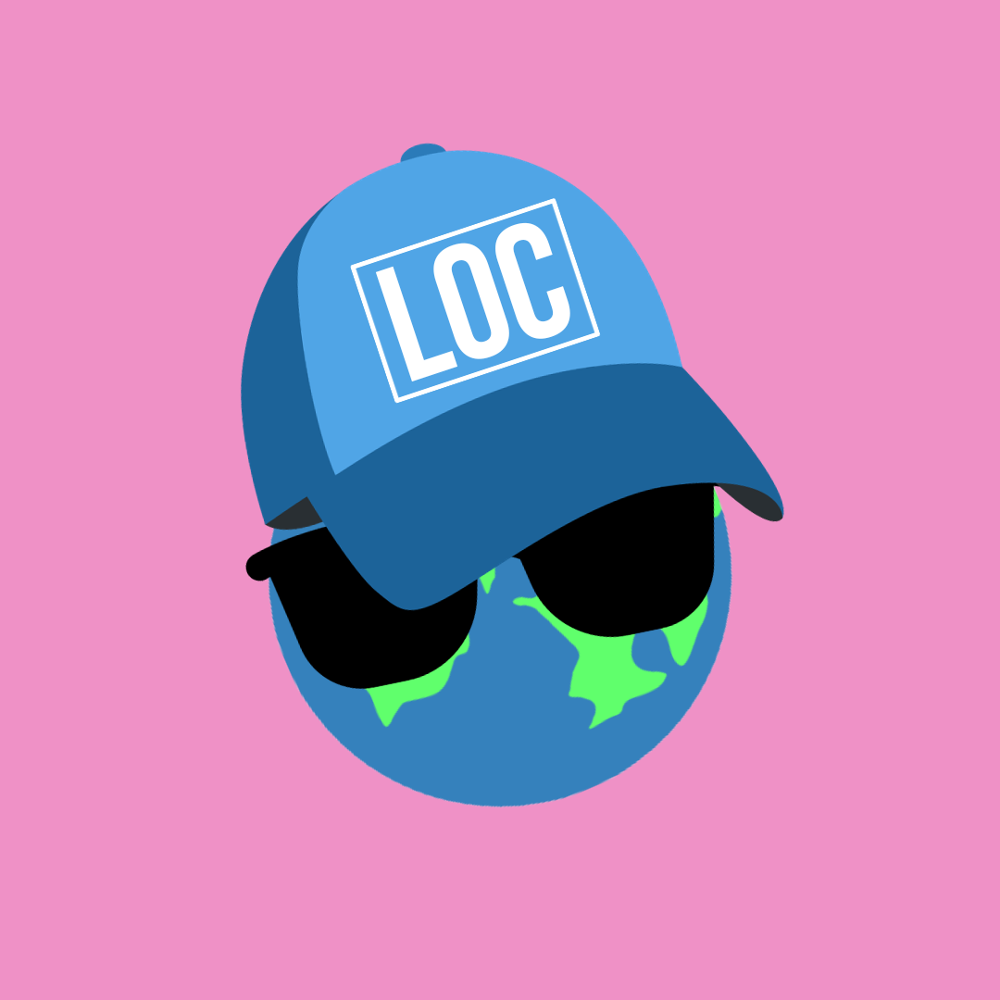

# Contacto

## Trabaja con nosotros

  <figure class="image-circle">
    
  </figure>

  

¿Te interesa trabajar con nosotros? Estamos diseñando activamente la web multilingüe y nos encantaría hablar sobre cómo podemos ayudar a tu organización a hacer lo mismo.

Trabajamos con organizaciones para desarrollar capacidades de localización a través de formación personalizada, consultoría estratégica y soluciones tecnológicas. Nuestros servicios incluyen:

- **Formación organizacional:** Programas adaptados que abarcan los fundamentos de la localización, la gestión de la calidad, la terminología, la tecnología de traducción y la IAG
- **Gestión y consultoría de contenido multilingüe:** Diseño de flujos de trabajo, gestión de la calidad de la traducción y estrategia terminológica
- **Desarrollo tecnológico a medida:** Sistemas de traducción basados en IAG, aseguramiento de la calidad en localización y automatización de flujos de trabajo diseñados según sus especificaciones

Todo proyecto comienza con una conversación de diagnóstico. Escríbenos y hablemos sobre lo que necesitas.

[Escríbenos](mailto:info@locessentials.com)
[Programa una reunión](https://calendar.app.google/MWC4k39EPMfjJ91HA)

  

---

## Conéctate con LocEssentials

- [LocEssentials](https://locessentials.com)
- [LinkedIn](https://www.linkedin.com/company/locessentials/)
- [YouTube](https://www.youtube.com/@locessentials)

